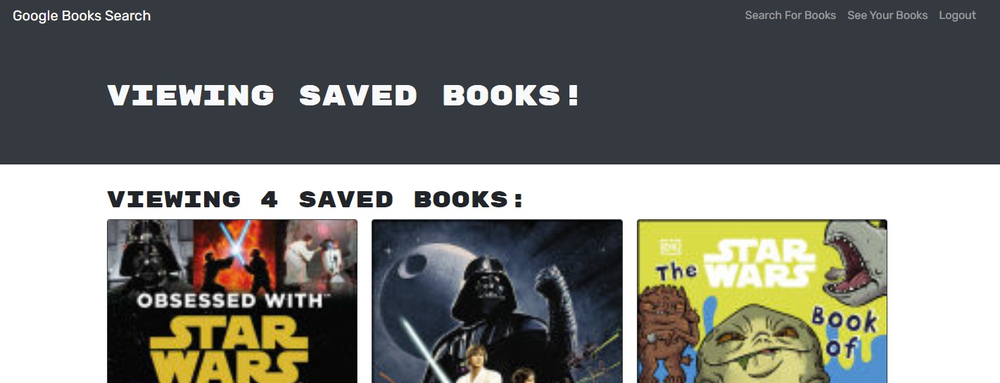

# Search For Books

## Table of Contents

- [Usage](#usage)
- [Questions](#questions)

## Description

This is a website that users can use to browse books, save books, view their saved books and delete books. This project was built with RESTful API and we were asked to refactor it to be a GraphQL API built with Apollo Server.

## Usage

To use this page simply click on the <a href="https://afternoon-fjord-78036.herokuapp.com/">Heroku link here</a>.

## Questions

<a href="https://github.com/JohnKnee3">JohnKnee3's GitHub</a>

If you want to contact me please send me an email at john.a.clark3@yahoo.com and I will get back to you as soon as possible.
